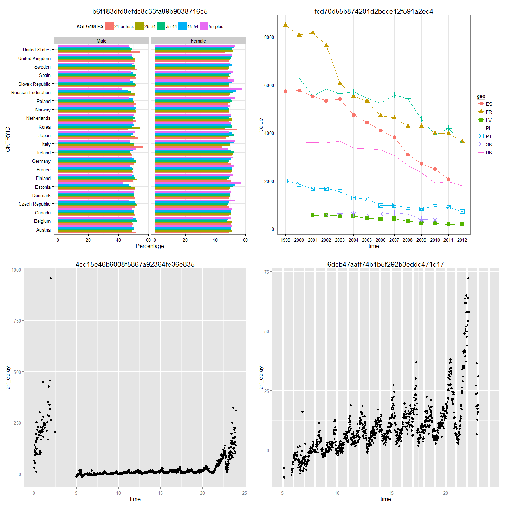

# Use case: retrieving partial results
April 6, 2015  

# Archivist as an accessibility engine

The archivist package allows to store, restore and look for R objects in repositories stored on hard disk. There are different strategies that can be used to find an object, through it's name, date of creation of meta data. The package is mainly designed as a repository of artifacts, but it can be used in different use-cases.


Open science rises new challenges, one of them is reproducibility yet another is availability of results.

When working with data scientists should not only be able to reproduce others results 
but also would like to make sure that they got 100% the same that others.

Archivist helps in the accessibility part of open science.
One can store partial results, search in repository of artifact, 
share artifacts with others or himself.

Below we are using some artifacts created during useR!2014 tutorial about dplyr given by Hadley Wickham.

These artifacts are stored on my github repository.
One can seek for all ggplots, plot them with their md5hashes,
and choose the one that it's looked for
.


```r
library(archivist)
library(grid)
library(gridExtra)
library(ggplot2)

md5plots <- searchInGithubRepo(pattern = "class:ggplot", repo = "graphGallery", user = "pbiecek", fixed = FALSE)
plots <- lapply(md5plots, function(pl) 
  loadFromGithubRepo(md5hash = pl, 
                   repo = "graphGallery", user = "pbiecek", value = TRUE) + ggtitle(pl))

do.call("grid.arrange", c(plots, ncol=round(sqrt(length(md5plots)))))
```



```r
summaryGithubRepo(repo = "graphGallery", user = "pbiecek")
```

```
Number of archived artifacts in the Repository:  12 
Number of archived datasets in the Repository:  4 
Number of various classes archived in the Repository: 
            Number
ggplot          4
tbl_df          3
grouped_df      3
area            1
proto           1
Saves per day in the Repository: 
            Saves
2014-08-21     4
2014-09-03    11
```

How artifacts in this database were created.


```r
# flightsRepo <- "~/GitHub/graphGallery/"
# 
# flights %>% 
#   saveToRepo(flightsRepo)
# 
# hourly_delay <- flights %>% 
#   filter(!is.na(dep_delay)) %>%
#   group_by(date, hour) %>%
#   summarise(
#     delay = mean(dep_delay),
#     n = n()
#   ) %>% 
#   filter(n > 10)
# 
# hourly_delay %>% 
#   saveToRepo(flightsRepo)
# 
# flights %>%
#   group_by(dest) %>%
#   summarise(arr_delay = mean(arr_delay, na.rm = TRUE), n = n()) %>%
#   arrange(desc(arr_delay)) %>% 
#   saveToRepo(flightsRepo)
# 
# flights %>% 
#   group_by(carrier, flight, dest) %>% 
#   tally(sort = TRUE) %>%
#   filter(n == 365) %>% 
#   saveToRepo(flightsRepo)
# 
# flights %>% 
#   group_by(carrier, flight, dest) %>% 
#   filter(n() == 365) %>% 
#   saveToRepo(flightsRepo)
# 
# per_hour <- flights %>%
#   filter(cancelled == 0) %>%
#   mutate(time = hour + minute / 60) %>%
#   group_by(time) %>%
#   summarise(arr_delay = mean(arr_delay, na.rm = TRUE), n = n())
# 
# per_hour %>% 
#   saveToRepo(flightsRepo)
# 
# qplot(time, arr_delay, data = per_hour) %>% 
#   saveToRepo(flightsRepo)
# 
# (ggplot(filter(per_hour, n > 30), aes(time, arr_delay)) + 
#   geom_vline(xintercept = 5:24, colour = "white", size = 2) +
#   geom_point()) %>% 
#   saveToRepo(flightsRepo)
```
