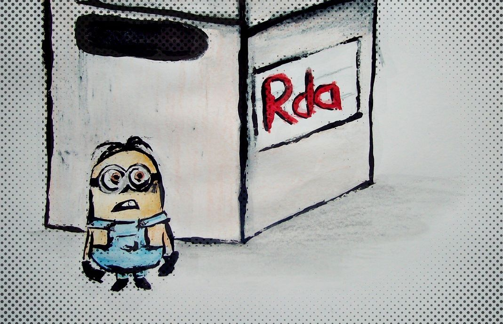

<!--
%\VignetteEngine{knitr::docco_classic}
%\VignetteIndexEntry{Lazy load}
-->

# Lazy load with **archivist**
> You can adjust the widths of the two columns using your cursor. What is more, press `T` on your keyboard, and see what happens.


Having problem with a too big `.Rdata` file? Interested only in a few objects from a huge `.Rdata` file?
Regular `load()` into Global Environment takes too long or crashes R session? Want to load or copy an object you don't remember name? Maintaing environment with thousands of objects became perplexing and troublesome  

**If you stacked with those questions, this use case is a must read for you.**

The **archivist** package is a great solution that helps administrate, archive and restore your [artifacts](https://github.com/pbiecek/archivist/wiki) created in [R](http://cran.r-project.org/) package.
```{r, cache=TRUE, message=FALSE, comment=""}
library(devtools)
if (!require(archivist)) install_github("archivist", "pbiecek")
library(tools)
```

## Combining **archivist** and lazy load may be miraculous

If your `.RData` file is too big and you do not need or do not want to load whole of it, you can simply convert the `.RData` file into a lazy-load database which serializes each entry separately and creates an index. The nice thing is that the loading will be on-demand.

````{r, cache=TRUE, message=FALSE, comment=""}
# convert .RData -> .rdb/.rdx
lazyLoad = local({load("Huge.RData"); environment()})
tools:::makeLazyLoadDB(lazyLoad, "Huge")
````

Loading the database then only loads the index but not the contents. The contents are loaded as they are used.
````{r, message=FALSE, comment=""}
lazyLoad("Huge")
length(ls()) ## there is a great number of objects
objNames <- ls()
````

Now you can create your own local **archivist**-like [Repository](https://github.com/pbiecek/archivist/wiki/archivist-package-Repository) which will make maintainig artifacts as easy as possible.
```{r, message=FALSE, comment=""}
DIRectory <- getwd()
createEmptyRepo( DIRectory )
```
Then objects from `Huge.RData` file may be archived into **Repository** created in `DIRectory` directory. The attribute `tags` (see [Tags](https://github.com/pbiecek/archivist/wiki/archivist-package---Tags)) spicified as `realName` is added to the every  artifact before `saveToRepo()` call, in case to remeber its name in **Repository**.
```{r, echo=FALSE, results='hide', message=FALSE, warning=FALSE}
library(cluster)
```

```{r, message=FALSE, comment="", warning=FALSE}
lapply( as.list(objNames[-208]), function(x){
  y <- get( x, envir = lazyLoad )
  attr(y, "tags") <- paste0("realName: ", x)
  saveToRepo( y, repoDir = DIRectory )
  } )[1:2]
```

You can check the summary of **Repository** using `summaryLocalRepo()` function.
```{r, comment="", cache=TRUE}
summaryLocalRepo( DIRectory )
```


