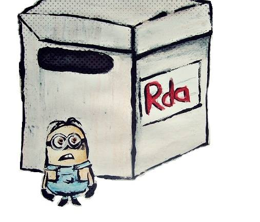

<!--
%\VignetteEngine{knitr::docco_classic}
%\VignetteIndexEntry{Lazy load}
-->

# Lazy load with **archivist**
> You can adjust the widths of the two columns using your cursor. Furthermore, press `T` on your keyboard, and see what happens.


Too big `.Rdata` file causing problems? Interested in few objects from a huge `.Rdata` file?
Regular `load()` into Global Environment takes too long or crashes R session? Want to load or copy an object with unknown name? Maintaing environment with thousands of objects became perplexing and troublesome?

```r
library(devtools)
if (!require(archivist)){
  install_github("archivist", "pbiecek")
  require(archivist)
  }
library(tools)
```
**If stacked with any of the above applies, this use case is a must read for you.**

The **archivist** package is a great solution that helps administer, archive and restore your [artifacts](https://github.com/pbiecek/archivist/wiki) created in [R](http://cran.r-project.org/) package.


## Combining **archivist** and lazy load may be miraculous

 If your `.RData` file is too big and you do not need or do not want to load the whole of it, you can simply convert the `.RData` file into a lazy-load database which serializes each entry separately and creates an index. The nice thing is that the loading will be on-demand.


```r
# convert .RData -> .rdb/.rdx
lazyLoad = local({load("Huge.RData"); 
                  environment()})
tools:::makeLazyLoadDB(lazyLoad, "Huge")
```

Loading the database then only loads the index but not the contents. The contents are loaded as they are used.

```r
lazyLoad("Huge")
objNames <- ls() #232 objects
```

Now you can create your own local **archivist**-like [Repository](https://github.com/pbiecek/archivist/wiki/archivist-package-Repository) which will make maintainig artifacts as easy as possible.

```r
DIRectory <- getwd()
createEmptyRepo( DIRectory )
```
Then objects from the `Huge.RData` file may be archived into **Repository** created in `DIRectory` directory. The attribute `tags` (see [Tags](https://github.com/pbiecek/archivist/wiki/archivist-package---Tags)) specified as `realName` is added to every  artifact before the `saveToRepo()` call, in order to remember its name in the **Repository**.


```r
lapply( as.list(objNames), function(x){
  y <- get( x, envir = lazyLoad )
  attr(y, "tags") <- paste0("realName: ", x)
  saveToRepo( y, repoDir = DIRectory )} )
```

 Now if you are interested in a specific artifact but the only thing you remember about it is its `class` was `data.frame` and its name started with letters `ir` then it is possible to search for that artifact using the `searchInLocalRepo()` function. 

```r
hashes1 <- searchInLocalRepo( "class:data.frame", DIRectory)
hashes2 <- searchInLocalRepo( "realName: ir", DIRectory, 
                               fixed = FALSE)
```
As a result we got [md5hashes](https://github.com/pbiecek/archivist/wiki/archivist-package-md5hash) of artifacts which class was `data.frame` (`hashes1`) and `md5hashes` of artifacts which names (stored in `tag` named `realName`) starts with `ir`. Now we can proceed with an intersection on those two vectors of characters.

```r
(hash <- intersect(hashes1, hashes2))
```

```
[1] "32ac7871f2b4875c9122a7d9f339f78b"
```
 After we got one `md5hash` corresponding to the artfiact we are interested in, we can load it using the `loadFromLocalRepo()` function.

```r
myData <- loadFromLocalRepo( hash, DIRectory, value = TRUE )
summary(myData[,-5])
```

```
  Sepal.Length   Sepal.Width    Petal.Length   Petal.Width 
 Min.   :4.30   Min.   :2.00   Min.   :1.00   Min.   :0.1  
 1st Qu.:5.10   1st Qu.:2.80   1st Qu.:1.60   1st Qu.:0.3  
 Median :5.80   Median :3.00   Median :4.35   Median :1.3  
 Mean   :5.84   Mean   :3.06   Mean   :3.76   Mean   :1.2  
 3rd Qu.:6.40   3rd Qu.:3.30   3rd Qu.:5.10   3rd Qu.:1.8  
 Max.   :7.90   Max.   :4.40   Max.   :6.90   Max.   :2.5  
```
One can always check the `realName` tag of that artifact with the `getTagsLocal()` function.

```r
getTagsLocal(hash, DIRectory, "realName")
```

```
[1] "realName: iris"
```
If only specific artifacts from previously created **Repository** in `DIRectory` directory are needed in future, they may be copied to a new **Repository** in new directory. New, smaller **Repository** will use less memory and may be easier to send to contributors when working in groups. Here is an example of copying artifacts only from selected classes. Because `DIRectory2` directory did not exist, the parameter `force=TRUE` was needed to force creating empty **Repository**. Vector `hashesR` contains `md5hashes` or artifacts that are related to other artifacts, which mean they are datasets used to compute other artifacts. The special parameter `fixed = TRUE` specifies to search in `tags` that start with letters `relation`.

```r
hashes <- unlist(sapply(c("class:coxph", "class:function",
                   "class:data.frame"), searchInLocalRepo, 
                 repoDir = DIRectory))
hashesR <- searchInLocalRepo( "relation", 
              repoDir = DIRectory, fixed = FALSE)
DIRectory2 <- (paste0( DIRectory, "/ex"))
createEmptyRepo( DIRectory2, force = TRUE )
copyLocalRepo( DIRectory, DIRectory2, 
               c( hashes, hashesR ) )
```

 You can even `tar` your **Repository** with `tarLocalRepo()` function and send it to anybody you want.

```r
tarLocalRepo( DIRectory2 )
```

You can check the summary of **Repository** using the `summaryLocalRepo()` function. As you can see, some of the `coxph` artifacts have an addtional class.  There are also 8 datasets. Those are artifacts needed to compute other artifacts and archived additionaly in the `saveToRepo()` call with default parameter `archiveData = TRUE`.

```r
summaryLocalRepo( DIRectory2 )
```

```
Number of archived artifacts in the Repository:  81 
Number of archived datasets in the Repository:  8 
Number of various classes archived in the Repository: 
             Number
data.frame      51
function        19
coxph           11
coxph.penal      4
coxph.null       1
Saves per day in the Repository: 
            Saves
2014-09-12    89
```
When **Repository** is no longer necessary we may simply delete it with `deleteRepo()` function.


```r
deleteRepo( DIRectory )
deleteRepo( DIRectory2 )
```


